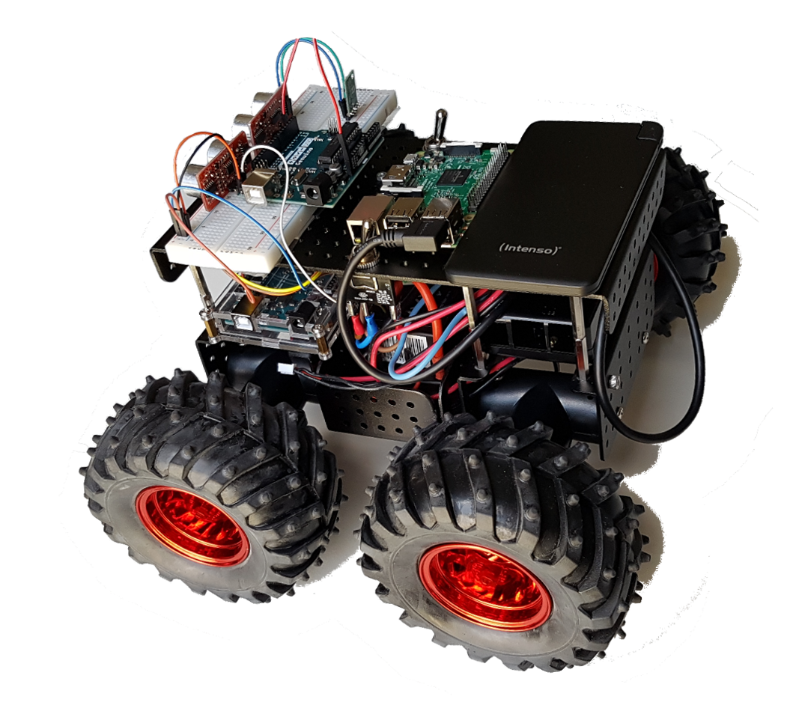

# autonomous-driving


This is the autonomous driving project of FH Hof. The code here is the result of different thesis of students.

This is the autonomous-driving test car



We tested it using Windows 10 operating system. If you clone it to “D:\Projekte” you will have the least amount of hassle. It should however run on Linux as well. 


We have some sub projects with different tasks:

# Sub projects

## working

If a subprojekt creates files, all of them are stored in this folder.
If you clone it it should be empty

## pylon-images

Here we manage pictures of pylons and backgrounds.

## image-generator

We use the images from pylon images to create training images.

## transfer-learning

We build up a neural network using the technique of transfer learning to recognize pylons from the training images. The finished neural network can then be exported as tflite or coral tflite.

## trained-networks

The fully trained neural networks are stored here.

## car-controller

The code for the raspberry pi and the Arduino can be found here.

## video

A video of a test course.

# Python Environments

We have a separate anaconda environment for each sub project. 
The name of the environment is the project name.
image-generator is the example environment in the following commands.

To use the commands navigate in a sub project with the anaconda prompt.

### create environment

```console
conda create -n transfer-learning python=3.5
```

### list of environments

```console
conda info --envs
```

### install environment

```console
conda env create -f environment.yml
```

### change environment

```console
conda activate image-generator
```

### remove environment

```console
conda remove --name image-generator --all
```

### update environment config

After a change of the environment the changes have to be saved in environment.yml.

```console
conda env export  > environment.yml
```
